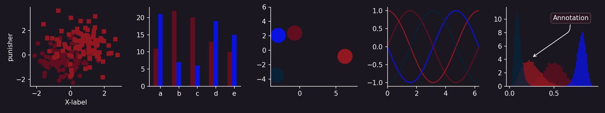

# palbums
matplotlib colour palettes based on album artwork

## Usage
Simply call
```python
import palbums
```
I _think_ this has to be done after importing `matplotlib`, but that's slightly
uncertain.

## Sources
The colours are as extracted from my [twitter bot](https://twitter.com/albumstoruin)

## Current Styles




## Inspiration
- The general structure of this module has been heavily lifted from the 
  excellent [`mplcyberpunk`](https://github.com/dhaitz/mplcyberpunk)
- The graph examples use a script taken from the `matplotlib`
  [docs](https://matplotlib.org/3.1.1/gallery/style_sheets/style_sheets_reference.html)
  with a small number of modifications